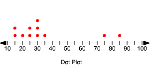

# Assessment 1: Introduction to Data Analysis, with Goals

**Final Grade:** 500 / 500

---

## Question 1 — Multiple Choice ✅ (10/10)

**Which of the following statements best defines data?**

- A. Data is an assortment of questions.
- B. Data is a business process.
- **C. ✅ Data is a collection of facts.** _(Correct answer)_
- D. Data is the use of calculations and statistics.

---

## Question 2 — Multiple Choice ✅ (10/10)

**In data analytics, the data ecosystem refers to the various elements that interact with one another to produce, manage, store, **\_**, analyze, and share data.**

- **A. ✅ Organize** _(Correct answer)_
- B. Ingest
- C. Merge
- D. Locate

---

## Question 3 — Multiple Choice ✅ (10/10)

**Which of the following terms refers to the collection, transformation, and organization of data in order to draw conclusions, make predictions, and drive informed decision-making?**

- A. Data life cycle
- B. Data insight
- C. Data elements
- **D. ✅ Data analysis** _(Correct answer)_

---

## Question 4 — Multiple Choice ✅ (10/10)

**An airline collects, observes, and analyzes its customers' online behaviors. Then, it uses the insights gained to choose what new products and services to offer. What business process does this describe?**

- A. Analytical thinking
- B. Performance measurement
- C. Collaboration with stakeholders
- **D. ✅ Data-driven decision-making** _(Correct answer)_

---

## Question 5 — Matching ✅ (10/10)

**Match the following types of data analyses to their business applications:**

| Type             | Application                                                                             |
| ---------------- | --------------------------------------------------------------------------------------- |
| **Descriptive**  | Monthly revenue reports                                                                 |
| **Diagnostic**   | A SaaS company drilling down to determine which marketing activities increased trials   |
| **Predictive**   | Using customer segmentation to determine which leads have the best chance of converting |
| **Prescriptive** | Netflix using AI to make informed decisions                                             |

---

## Question 6 — True/False ✅ (10/10)

**The role of a data analyst can be defined as someone who has the knowledge and skills to turn raw data into information and insight, which can be used to make business decisions.**

- **True ✅** _(Correct answer)_
- False

---

## Question 7 — Multiple Choice ✅ (10/10)

**Which of the following are the essential Data Analyst skills?**

- A. Data cleaning and preparation
- B. Data analysis and exploration
- C. Statistical knowledge
- D. Creating data visualizations
- E. Creating dashboards and reports
- F. Writing and communication
- G. Domain knowledge
- H. Problem solving
- **I. ✅ All of the above** _(Correct answer)_

---

## Question 8 — Multiple Choice ✅ (10/10)

**Which of the following are the emerging technologies in Data Analytics?**

- A. AI
- B. Automated Machine Learning
- C. Quantum Computing
- D. Digital Twins
- **E. ✅ All of the above** _(Correct answer)_

---

## Question 9 — Multiple Choice ✅ (10/10)

**Identify which language is used in Data Science?**

- A. C++
- **B. ✅ R** _(Correct answer)_
- C. Java
- D. Ruby

---

## Question 10 — True/False ✅ (10/10)

**Unstructured data is not organized.**

- **True ✅** _(Correct answer)_
- False

---

## Question 11 — True/False ✅ (10/10)

**A data frame is an unstructured representation of data.**

- True
- **False ✅** _(Correct answer)_

---

## Question 12 — Multiple Choice ✅ (10/10)

**Arrange the following statistical measures from the simplest to the most complex.**

- A. Mode
- B. Mean
- C. Median
- D. Standard Deviation

Choices:

- A. A, B, C, D
- B. B, C, A, D
- C. D, C, B, A
- **D. ✅ A, C, B, D** _(Correct answer)_

---

## Question 13 — Multiple Choice ✅ (10/10)

**Which of the following is an essential process in which the intelligent methods are applied to extract data patterns?**

- A. Warehousing
- **B. ✅ Data mining** _(Correct answer)_
- C. Text Mining
- D. Data Selection

---

## Question 14 — Multiple Choice ✅ (10/10)

**What are the functions of Data Mining?**

- A. Association and correctional analysis classification
- B. Prediction and characterization
- C. Cluster analysis and Evolution analysis
- **D. ✅ All of the above** _(Correct answer)_

---

## Question 15 — Multiple Choice ✅ (10/10)

**Which of the following systems use RDMS?**

- A. Oracle
- B. Microsoft SQL Server
- C. IBM
- **D. ✅ All of the above** _(Correct answer)_

---

## Question 16 — Multiple Choice ✅ (10/10)

**Which of the following is the benefit of using non-relational DBMS?**

- A. Strict data modeling
- B. Limited scalability
- **C. ✅ Easy schema evolution** _(Correct answer)_
- D. Limited data storage capacity

---

## Question 17 — Multiple Choice ✅ (10/10)

**Which of the following statement(s) about stack data structure is/are NOT correct?**

- A. Top of the Stack always contain the new node
- **B. ✅ Stack is the FIFO data structure** _(Correct answer)_
- C. Null link is present in the last node at the bottom of the stack
- D. Linked List are used for implementing Stacks

---

## Question 18 — Multiple Choice ✅ (10/10)

**Which of the following points is/are not true about Linked List data structure when it is compared with an array?**

- A. Random access is not allowed in a typical implementation of Linked Lists
- **B. ✅ Access of elements in linked list takes less time than compared to arrays** _(Correct answer)_
- C. Arrays have better cache locality that can make them better in terms of performance
- D. It is easy to insert and delete elements in Linked List

---

## Question 19 — Multiple Choice ✅ (10/10)

**Which of the following is a source of secondary data in research?**

- A. Relics
- **B. ✅ Novel written in the past by someone** _(Correct answer)_
- C. Registered deeds
- D. Prediction on the basis of trends

---

## Question 20 — Matching ✅ (10/10)

**Match the definitions:**

| Term               | Definition                                                                                                                                  |
| ------------------ | ------------------------------------------------------------------------------------------------------------------------------------------- |
| **Data Warehouse** | Central repository that merges information from different sources into a comprehensive database used for analytical and business techniques |
| **Data Marts**     | Built for a particular operational task or a business function, purpose, or community of users                                              |
| **Data Lake**      | Repository of data that stores all types of data, whether structured, unstructured, or semi-structured                                      |

---

## Question 21 — Matching ✅ (10/10)

**Match the Tiers of a Data Warehouse:**

| Tier       | Component              |
| ---------- | ---------------------- |
| **Bottom** | Database servers       |
| **Middle** | OLAP Server            |
| **Top**    | Client front end layer |

---

## Question 22 — Multiple Choice ✅ (10/10)

**What type of data does an ETL developer get data warehouse information from after implementing the ETL processes?**

- **A. ✅ Structured** _(Correct answer)_
- B. Formed
- C. Unstructured
- D. Unformed

---

## Question 23 — Multiple Choice ✅ (10/10)

**Which of the following are the data access methods in the ETL process?**

- A. Pull method
- **B. ✅ Push and Pull** _(Correct answer)_
- C. Load in parallel
- D. Union All

---

## Question 24 — Multiple Choice ✅ (10/10)

**ETL testing includes?**

- A. Verify whether the data is transforming correctly according to business requirements
- B. Make sure that ETL application reports invalid data and replaces with default values
- C. Make sure that data loads at expected time frame to improve scalability and performance
- **D. ✅ All of the above** _(Correct answer)_

---

## Question 25 — Multiple Choice ✅ (10/10)

**In ETL, transformations are of **\_** types.**

- **A. ✅ 2** _(Correct answer)_
- B. 3
- C. 4
- D. 5

---

## Question 26 — Multiple Choice ✅ (10/10)

**Which NoSQL database is known for its ability to handle complex queries and data analysis?**

- A. HBase
- B. Cassandra
- **C. ✅ MongoDB** _(Correct answer)_
- D. Couchbase

---

## Question 27 — True/False ✅ (10/10)

**Data in operational systems are typically fragmented and inconsistent.**

- **True ✅** _(Correct answer)_
- False

---

## Question 28 — Multiple Choice ✅ (10/10)

**Which of the following maps the core warehouse metadata to business concepts, familiar and useful to end-users?**

- A. Algorithmic level metadata
- **B. ✅ Application-level metadata** _(Correct answer)_
- C. Core level metadata
- D. End-user level metadata

---

## Question 29 — Multiple Choice ✅ (10/10)

**Which of the following are the use cases of Apache Spark?**

- A. Processing streaming data
- B. Machine Learning
- C. Fog Computing
- **D. ✅ All of the above** _(Correct answer)_

---

## Question 30 — Multiple Choice ✅ (10/10)

**Which of the following is a benefit of using Spark SQL?**

- **A. ✅ Faster data processing** _(Correct answer)_
- B. Better support for unstructured data
- C. Easier integration with NoSQL databases
- D. More flexibility in data processing operations

---

## Question 31 — Multiple Choice ✅ (10/10)

**Which of the following is a common use case for Spark Streaming?**

- **A. ✅ Fraud detection** _(Correct answer)_
- B. Recommender systems
- C. Sentiment analysis
- D. Image recognition

---

## Question 32 — Multiple Choice ✅ (10/10)

**In terms of Big Data, what is Veracity?**

- A. Different forms of structured and unstructured data
- **B. ✅ Uncertainty of data, including biases, noise, and abnormalities** _(Correct answer)_
- C. Scale of data
- D. Analysis of streaming data as it travels around the Internet

---

## Question 33 — True/False ✅ (10/10)

**R is used for Data wrangling.**

- **True ✅** _(Correct answer)_
- False

---

## Question 34 — True/False ✅ (10/10)

**Data that is obtained directly from the source is called Primary Data.**

- **True ✅** _(Correct answer)_
- False

---

## Question 35 — Multiple Choice ✅ (10/10)

**What is the process by which search engines retrieve webpages and build a search index called?**

- A. Scrape
- B. Parse
- C. BeautifulSoup
- **D. ✅ Spider** _(Correct answer)_

---

## Question 36 — True/False ✅ (10/10)

**Extracting XML is the basis for most web scraping.**

- **True ✅** _(Correct answer)_
- False

---

## Question 37 — True/False ✅ (10/10)

**Something must have the © sign to be copyrighted.**

- True
- **False ✅** _(Correct answer)_

---

## Question 38 — True/False ✅ (10/10)

**If you see the word copyright, the © logo or "All rights reserved", all the content on that site is very likely protected by copyright.**

- **True ✅** _(Correct answer)_
- False

---

## Question 39 — Multiple Choice ✅ (10/10)

**What does the term 'outlier' mean?**

- A. A score that is left out of the analysis because of missing data
- B. The arithmetic mean
- C. A type of variable that cannot be quantified
- **D. ✅ An extreme value at either end of a distribution** _(Correct answer)_

---

## Question 40 — Multiple Choice ✅ (10/10)

**In the following dot plot image, which data point is an outlier? (Choose all that apply)** 

- **A. ✅ 75** _(Correct answer — 50%)_
- **B. ✅ 85** _(Correct answer — 50%)_
- C. 35 _(0%)_
- D. None of the above _(0%)_

---

## Question 41 — Multiple Choice ✅ (10/10)

**Identify the incorrect option among the following which is not involved in data mining.**

- A. Data exploration
- B. Knowledge extraction
- C. Data transformation
- **D. ✅ Data archaeology** _(Correct answer)_

---

## Question 42 — Multiple Choice ✅ (10/10)

**What is KDD in data mining?**

- **A. ✅ Knowledge Discovery Database** _(Correct answer)_
- B. Knowledge Discovery Data
- C. Knowledge Data Definition
- D. Knowledge Data House

---

## Question 43 — Multiple Choice ✅ (10/10)

**A general direction in which something is developing or changing is called a **\_\_\_\_**.**

- **A. ✅ Trend** _(Correct answer)_
- B. Anomaly
- C. Pattern
- D. Variance

---

## Question 44 — Multiple Choice ✅ (10/10)

**Something that deviates from what is standard, normal or expected is called **\_\_\_**.**

- A. Trend
- **B. ✅ Anomaly** _(Correct answer)_
- C. Pattern
- D. Variance

---

## Question 45 — Multiple Choice ✅ (10/10)

**A series of data that repeats in a recognizable way is called **\_\_\_\_**.**

- A. Trend
- B. Anomaly
- **C. ✅ Pattern** _(Correct answer)_
- D. Variance

---

## Question 46 — Multiple Choice ✅ (10/10)

**The degree of spread in a data set about the mean value of that data is called **\_\_\_\_**.**

- A. Trend
- B. Anomaly
- C. Pattern
- **D. ✅ Variance** _(Correct answer)_

---

## Question 47 — Multiple Choice ✅ (10/10)

**In regression, the equation that describes how the response variable (y) is related to the explanatory variable (x) is:**

- A. The correlation model
- **B. ✅ The regression model** _(Correct answer)_
- C. Used to compute the correlation coefficient
- D. None of the above

---

## Question 48 — Multiple Choice ✅ (10/10)

**Matplotlib is a \_\_\_\_ library for the Python programming language.**

- A. Data science
- B. Mathematics
