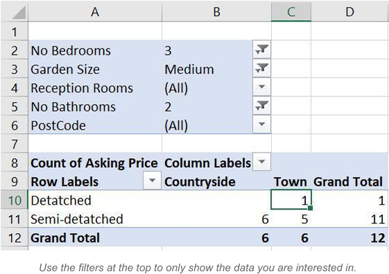
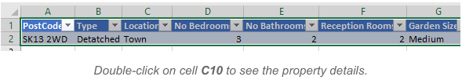

# Course Two Week Four: Pivot Activity Instructions

Open the file contained within the folder name shown above.

## Create a Pivot Table

Create a pivot table of the property portfolio to show:

- The asking price as the value field;
- The type of property in the rows;
- The location in the columns;
- The remaining fields in the filter area.

## Filter and Aggregate

Change the filters and aggregate functions to show a count of properties that have:

- 3 bedrooms;
- A medium garden; and
- 2 bathrooms.

Your pivot table should look something like this:

## Drill Down

There is only one property that is detached and located in a town — use drill down to show this:

## Update the Pivot Table

Change your pivot table so that it now shows the average asking price of houses with:

- The postcode of the property in the rows;
- The type of property in the columns; and
- The remaining fields in the filter area.

Double-click on any property price to see the full details.

## Save Your File

Use **Save As...** to save the file in your own new Excel work folder.

## Solution

- [Property Portfolio - Pivot Activity.xlsx](./Property%20Portfolio%20-%20Pivot%20Activity.xlsx) _(32 KB)_
