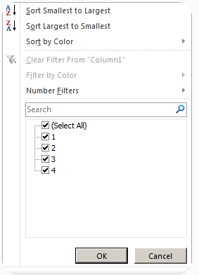
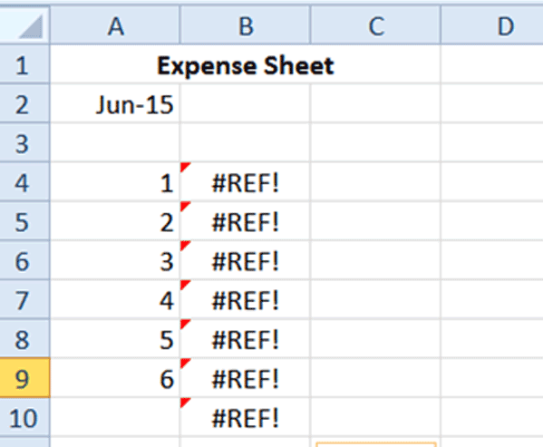
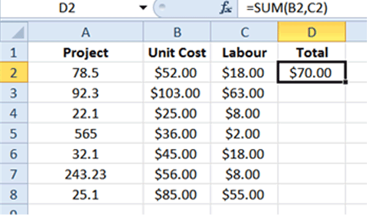
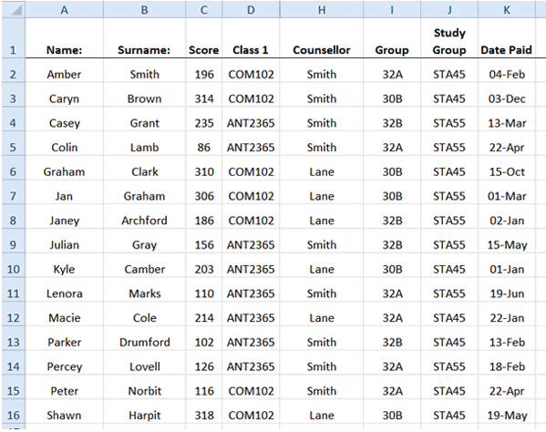

# Assessment 2: Excel for Data Analysis, with Goals

**Final Grade:** 500 / 500

---

## Question 1 — What does the auto calculate feature do? — ✅ 10/10

- Can only add values in a range of cells
- **✅ Correct: Provides a quick way to view the result of an arithmetic operation on a range of cells**
- Both
- None of the above

---

## Question 2 — The number of columns in a worksheet is — ✅ 10/10

- 365
- 655
- **✅ Correct: 256**
- 645

---

## Question 3 — If you wanted to sort an employee file so that they would be listed alphabetically by last name and first name within individual zip codes (smallest to largest), which of the following would be the correct order of the sort? — ✅ 10/10

- **✅ Correct: zip codes (ascending), then last name (ascending), then first name (ascending)**
- last name (ascending), then first name (ascending), then last name (ascending)
- zip codes (descending), then last name (ascending), then first name (ascending)
- last name (descending), then first name (descending), then last name (descending)

**Feedback:** Because the list should be arranged alphabetically from smallest to largest within individual zip codes, they should be sorted by zip codes (ascending), then by last name and then first name, all ascending.

---

## Question 4 — What will the formula `=RIGHT("TestBook", 2)` return? — ✅ 10/10

- **✅ Correct: ok**
- Bo
- Te
- st

---

## Question 5 — What does the VLOOKUP function do in Excel? — ✅ 10/10

- **✅ Correct: It looks vertically down the first column of a range for a key and returns the value of a specified cell in the row found**
- It calculates the average of a range of cells
- It replaces specific text in a text string
- It divides the contents of one cell from another

---

## Question 6 — What is the shortcut to autosum all the numerical values in a column in MS Excel? — ✅ 10/10

- CTRL+Screen lock
- Shift + =
- Alt+Shift+ =
- **✅ Correct: Alt+ =**

---

## Question 7 — What is the shortcut key to switch between absolute, relative, and mixed cell references in a formula? — ✅ 10/10

- **✅ Correct: F4**
- F5
- F6
- F7

---

## Question 8 — Comments put in cells are called **\_\_\_** — — ✅ 10/10

- Smart tip
- **✅ Correct: Cell tip**
- Web tip
- Soft Tip

---

## Question 9 — What symbol is used to enter a number as text? — ✅ 10/10

- **✅ Correct: '**
- "
- =
- -

---

## Question 10 — Which area in an Excel window allows entering values and formulas? — ✅ 10/10

- Title bar
- Menu bar
- **✅ Correct: Formula bar**
- Standard Tool bar

---

## Question 11 — Multiple calculations can be made in a single formula using.. — — ✅ 10/10

- Standard formula
- **✅ Correct: Array Formula**
- Complex formulas
- Smart formulas

---

## Question 12 — Which is not the function of "Edit, Clear" command? — ✅ 10/10

- Delete contents
- delete notes
- **✅ Correct: delete cells**
- delete formats

---

## Question 13 — How do you wrap the text in a cell? — ✅ 10/10

- Format, cells, font
- Format, cells, protection
- Format, cells, number
- **✅ Correct: Format, cells, alignment**

---

## Question 14 — Cell E# has a date value and you wish to place that date on an invoice prefaced with the text located in &' — What is the command to do that? — ✅ 10/10

- `=B15&E23`
- **✅ Correct: `=proper(B15)&""&text(E23,"mmmm dd,yyyy")`**
- `=join(B15&E23)`
- `B15&""&E23`

---

## Question 15 — If you require more than two conditions or if you want to analyze a list using Excel 2003's database functions, you must define which filter? — ✅ 10/10

- Auto filter
- Update filter
- advantage filter
- **✅ Correct: advanced criteria filter**

---

## Question 16 — What does the NOW() function return? — ✅ 10/10

- **✅ Correct: It returns the serial number of the current date and time**
- It returns the serial number of the current date
- It returns the serial number of the current time
- None of the above

---

## Question 17 — How to restrict the values of a cell so that only whole numbers between 9 and 99 can be entered in a cell? — ✅ 10/10

- Settings tab under the menu Format cells
- **✅ Correct: Settings tab under the menu Data Validation**
- Settings tab under the menu Data filter
- Settings tab under the menu Format Conditional Formatting

---

## Question 18 — What does COUNTA() function do? — ✅ 10/10

- Counts cells having alphabets
- Counts empty cells
- Counts cells having number
- **✅ Correct: Counts non-empty cells**

---

## Question 19 — What is one of the ways to apply new data formats to the rest of the column? — ✅ 10/10

- Paste special tool
- Text import wizard
- Format button
- **✅ Correct: Format Painter tool**

---

## Question 20 — From the following list of choices, select the choice that BEST describes the purpose of using the Paste Special feature in Excel — — ✅ 10/10

- It allows you to paste special characters, such as the trademark symbol, into a worksheet.
- It allows you to copy data from a Microsoft Word table and paste it into an Excel worksheet.
- **✅ Correct: It allows you to copy cells and then paste only selected elements into a new location.**
- It allows you to paste links between Microsoft Access and Microsoft Excel into a workbook.

---

## Question 21 — From the following list, select the choice that BEST describes the purpose of auditing workbooks in Excel — — ✅ 10/10

- Auditing allows you to trace relationships between worksheets.
- **✅ Correct: Auditing allows you to trace formula references between cells.**
- Auditing allows you to spot financial errors in workbooks.
- Auditing allows you to trace relationships between workbooks.

---

## Question 22 — From the following list, select the choice that is an available method of sorting field data within an Excel table — — ✅ 10/10

- **✅ Correct: Ascending**
- Opposing
- Reversing
- Increasing

---

## Question 23 — From the following list of choices, select the choice that any table that uses the "AutoFilter" feature MUST possess for the feature to function properly — — ✅ 10/10

- An applied sort order
- A custom sort order
- A list AutoFormat
- **✅ Correct: A header row**

---

## Question 24 — From the following list, select the choice that BEST describes the purpose of creating data tables within Excel — — ✅ 10/10

- **✅ Correct: Data tables allow you to change variables in a formula to view different possible outcomes.**
- Data tables allow you to change filters in a table to view different possible outcomes.
- Data tables allow you to change scenarios in a worksheet to view different possible outcomes.
- Data tables allow you to change functions in a formula to view different possible outcomes.

---

## Question 25 — From the following list, select the function within Excel that allows you to look up values in a table that is structured in columns with a "header row" at the top of the table — — ✅ 10/10

- HLOOKUP
- **✅ Correct: VLOOKUP**
- RLOOKUP
- CLOOKUP

---

## Question 26 — **\_** tables allow filtering through different values — — ✅ 10/10

- Pivot
- Data
- **✅ Correct: Both**
- None of the above

---

## Question 27 — Once data in a table gets filtered, you cannot unfilter the table nor get the table back to the original settings — Is this statement correct? — ✅ 10/10

- No, you may change filters up to three times.
- Yes
- **✅ Correct: No, you may change filters as many times as you please without limits**
- No, tables cannot be filtered

---

## Question 28 — Which pivot table layout allows dragging fields to the grid in a spreadsheet? — ✅ 10/10

- Default Pivot Table Layout
- **✅ Correct: Classic Pivot Table Layout**
- Master Pivot Table Layout
- Operation Geronimo Layout

---

## Question 29 — For the attached image (`Filtering data.png`), check all that are true — — ✅ 10/10

- The boxes that are checked indicate that the table should filter out that data — — 0%
- **✅ Correct: The boxes that are checked indicate that the table will filter in that data — — 50%**
- **✅ Correct: The boxes that are unchecked indicate that the table will filter out that data — — 50%**
- The boxes that are unchecked indicate that the table will not filter in that data unless values are present — — 0%

---

## Question 30 — Pivot tables that have been created can easily be turned into graphs or charts by simply highlighting the whole pivot table and choosing a graph or chart that you want to create — — ✅ 10/10

- **✅ Correct: True**
- False

---

## Question 31 — Which of these is NOT included in the PivotTable Field List pane? — ✅ 10/10

- Column labels
- Values
- Report filter
- **✅ Correct: Formulas**

---

## Question 32 — The Sum function is applied to values in a Pivot Table by default — How can I change this so that values are automatically counted and not summed? — ✅ 10/10

- Insert the COUNT formula (`=Count()`) into the PivotTable.
- Change the format of the values in the Pivot Table to General Numbers.
- **✅ Correct: In the Calculations group, change the Summarize Values By to Count.**
- All of the above

---

## Question 33 — After inserting a Pivot Table, the Pivot Table Field List does not automatically appear — How can you activate this area? — ✅ 10/10

- **✅ Correct: Click on the Field List button in the Show group, under Options in the PivotTable Tools contextual tab.**
- Click on the Insert Pivot Table button and select PivotTable Fields List.
- Go to the Backstage View and in the Options dialogue box, click on the PivotTable tab — Check the box for PivotTable Fields List.
- All of the above

---

## Question 34 — Priya is reviewing a spreadsheet for a colleague — She notes that part of all the formulas contain dollar symbols in the cell references, for example `=A1*$B$` and starts deleting the dollar symbols — Is that a good or bad idea and why? — ✅ 10/10

- Good idea — The person who created the spreadsheet clearly made a typing error by including the dollar symbols.
- Bad idea — The dollar symbols are needed to format the calculated values of the formula with the correct currency symbol.
- Bad idea — The dollar symbols mark the references in the cells as Relative References — Removing these will cause the formula to calculate incorrect values.
- **✅ Correct: Bad idea — The dollar symbols mark the references in the cells as Absolute References — Removing these will cause the formula to calculate incorrect values.**

---

## Question 35 — Study the screenshot attached (`paste values.png`) — Miley copied values from a different worksheet and pasted it into column B of her expense sheet — However, when she pastes it, the above errors appear — What is happening and how can she fix it? — ✅ 10/10

- She used Relative References instead of Absolute References in her formulas — If she changes to Absolute references the problem will be resolved.
- She copied and pasted the incorrect cells — To prevent errors in copying and pasting cell values, she should use the Fill Handle.
- **✅ Correct: She copied cell formulas instead of values — She should copy and paste the cells again and select Paste Values from the Paste Menu.**
- She used Absolute References instead of Relative References in her formulas — If she changes to Relative references the problem will be resolved.

---

## Question 36 — Study the screenshot attached (`fill.png`) — Which of the following options correctly predicts what the contents of cell D3 will be if the Fill Handle is used to copy down cell D2? — ✅ 10/10

- **✅ Correct: D3 will contain the formula: `=SUM(B3,C3)`.**
- D3 will contain the formula: `=SUM(B2,C2)`.
- D3 will contain the formula: `=SUM(D2,C2)`.
- D3 will contain an error message as the formula cannot be copied down without the references being made Absolute.

---

## Question 37 — Which of the following options correctly represent a formula with Absolute References? — ✅ 10/10

- `=(A$1$-B$1$)`
- `=(A$1-B$1)`
- `=($A1-$B1)`
- **✅ Correct: `=($A$1-$B$1)`**

---

## Question 38 — What is the shortcut for creating absolute references and how do you use it? — ✅ 10/10

- Select the cell reference you wish to make Absolute and press Ctrl+A on your keyboard.
- Select the cell reference you wish to make Absolute and press Ctrl+F4 on your keyboard.
- **✅ Correct: Select the cell reference you wish to make Absolute and press F4 on your keyboard.**
- Select the cell reference you wish to make Absolute and press Ctrl+$ on your keyboard.

---

## Question 39 — Copying formulas saves a lot of time — Which of the following is a method for copying a formula? — ✅ 10/10

- Ctrl+C to copy the formula, Ctrl+V to paste the formula.
- Drag the Fill Handle down, up, left or right to copy a formula.
- Press the Copy button on the Ribbon to copy the formula and the Paste button on the Ribbon to paste it.
- **✅ Correct: All of the above**

---

## Question 40 — Which of the following syntax is correct regarding the SUM function in Excel? — ✅ 10/10

- `=SUM(A1, B1)`
- `=SUM(A1:B9)`
- `=SUM(A1:A9, B1:B9)`
- **✅ Correct: All of the above**

---

## Question 41 — What is the shortcut key combination to format selected cells with a currency symbol? — ✅ 10/10

- Ctrl+Alt+$
- **✅ Correct: Ctrl+Shift+$**
- Ctrl+$
- Shift+$

---

## Question 42 — Which of the following is correct syntax in Excel? — ✅ 10/10

- **✅ Correct: `=IF(LogicalTest, TrueResult, FalseResult)`**
- `=IF(LogicalTest, (TrueResult, FalseResult))`
- `=IF(LogicalTest, TrueResult) (LogicalTest, FalseResult)`
- `=IF(LogicalTest, TrueResult), IF(LogicalTest, FalseResult)`

---

## Question 43 — Which of the following functions is used to round a number to a specified number of decimal places? — ✅ 10/10

- ROUNDUP
- ROUNDDOWN
- **✅ Correct: ROUND**
- TRUNC

---

## Question 44 — Which of the following functions is used to calculate the average of a range of cells, ignoring zero values? — ✅ 10/10

- AVERAGE
- **✅ Correct: AVERAGEIF**
- AVERAGEIFS
- AGGREGATE

---

## Question 45 — Which of the following is the concatenating operator? — ✅ 10/10

- '
- !
- **✅ Correct: &**
- #

---

## Question 46 — Which of the following statements is incorrect regarding Excel? — ✅ 10/10

- **✅ Correct: The result of the array formula is always a single value**
- `=SUM(LEN(A2:A11))` is an example of the array formula
- Multiple array formulas need to be entered using Ctrl+Shift+Enter
- An array formula operates on multiple values

---

## Question 47 — The accounting style shows negative numbers in — ✅ 10/10

- Bold
- Brackets
- **✅ Correct: Parenthesis**
- Quotes

---

## Question 48 — Delimiter is necessary to split text into different columns — — ✅ 10/10

- **✅ Correct: True**
- False

---

## Question 49 — Which tool shows unique records only and does not completely remove the duplicate record? — ✅ 10/10

- Sort data
- Remove duplicates
- **✅ Correct: Advanced filter**
- Data validation

---

## Question 50 — Study the screenshot attached (`sort and filter.png`) — James' manager wants him to reorganize this sheet into date order using the _Date Paid_ column — Which option below will allow him to do this quickly? — ✅ 10/10

- James can use the Cut and Paste function to reorganize the data into date order.
- James can use the Filter function to organize the data into date order.
- James can use the Order function to organize the data into date order.
- **✅ Correct: James can use the Sort function to organize the data into date order**
