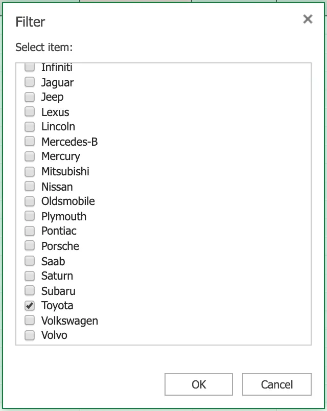
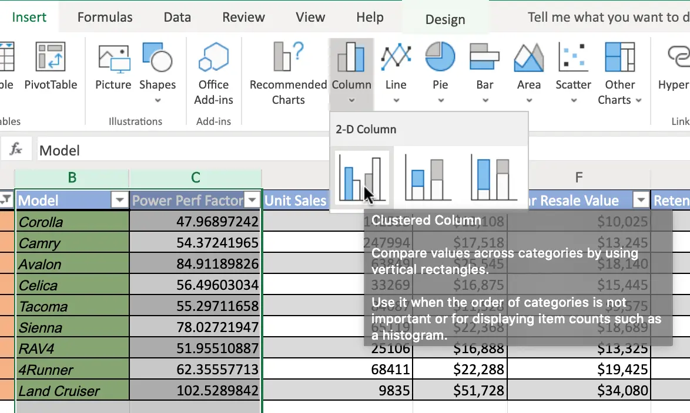
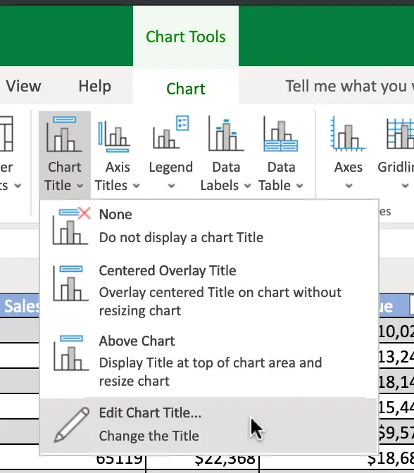
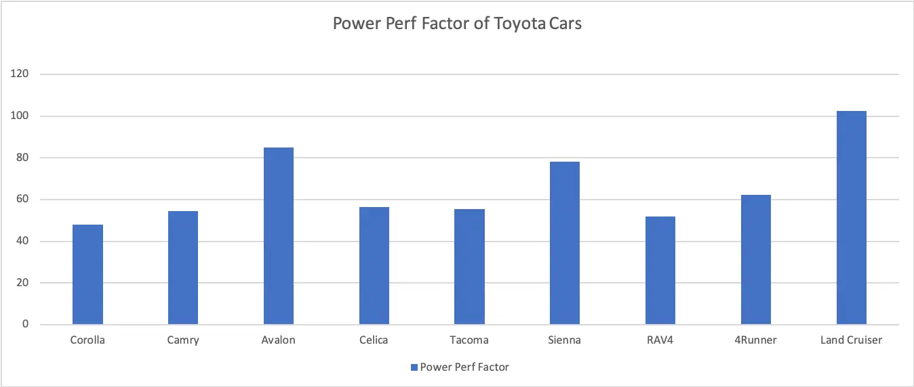
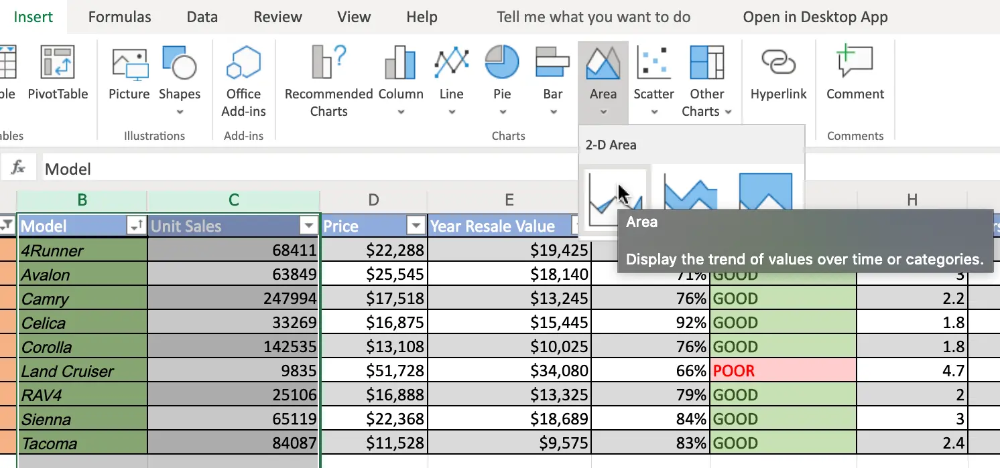
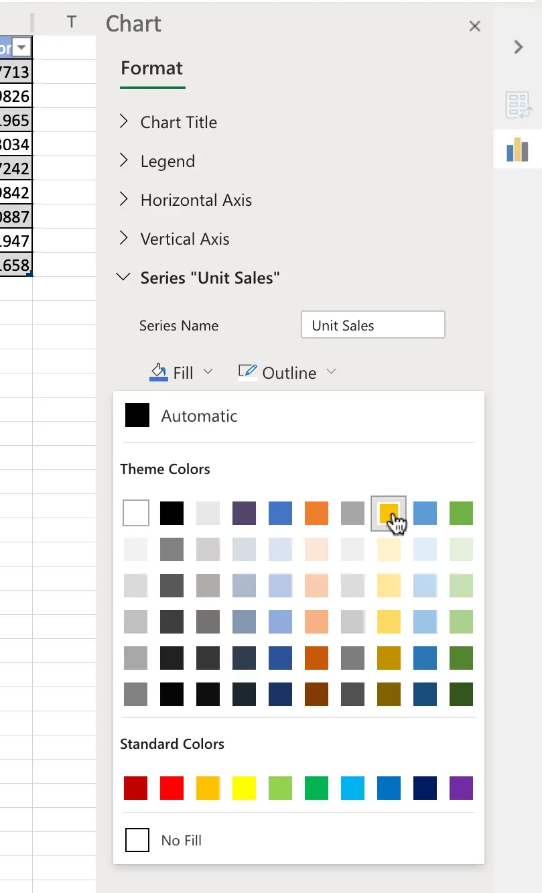
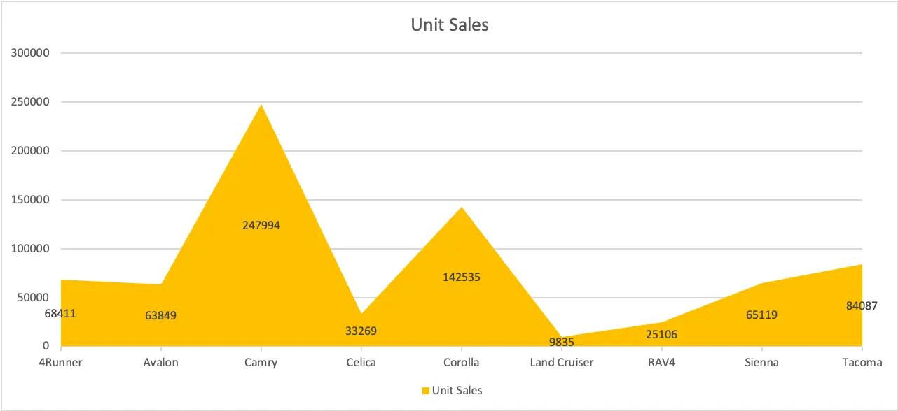
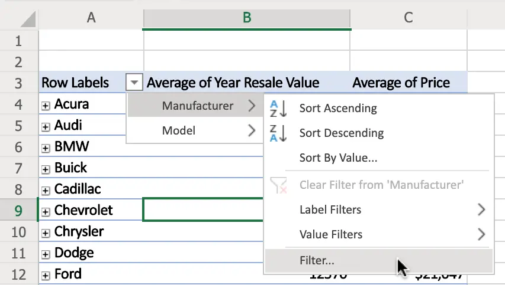
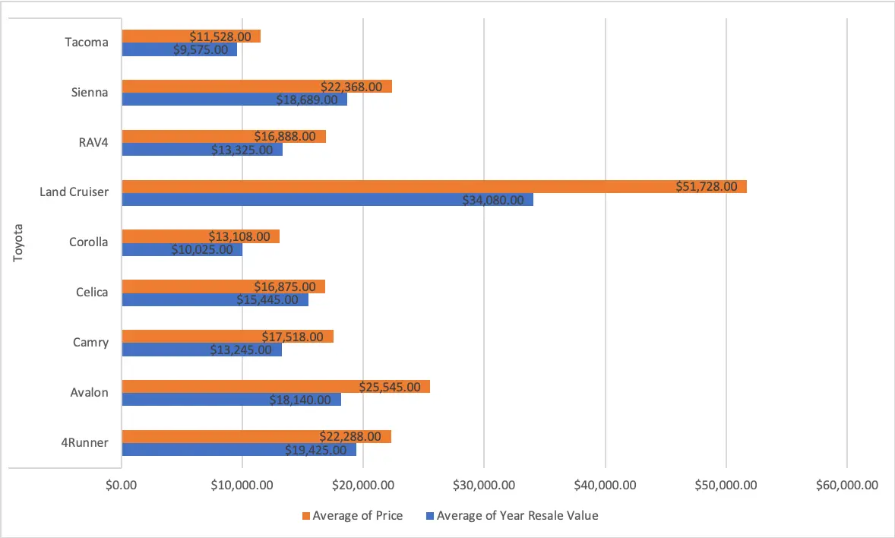
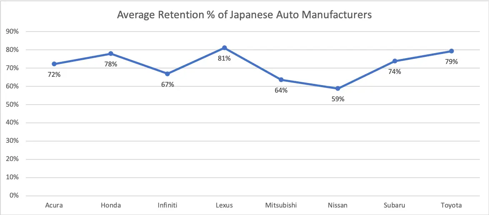

# Exercise 1: Creating Column Charts and Area Charts in Excel

In this exercise, you will learn how to create basic charts, such as column and area charts, in Excel.

## Task A: Create a Column Chart

1. Download the file [Car_Sales_Kaggle_DV0130EN_Lab1_Start.xlsx](https://cf-courses-data.s3.us.cloud-object-storage.appdomain.cloud/IBMDeveloperSkillsNetwork-DV0130EN-SkillsNetwork/Hands-on%20Labs/Lab%201%20-%20Creating%20Basic%20Charts/Car_Sales_Kaggle_DV0130EN_Lab1_Start.xlsx). Upload and open it using Excel for the web.
2. Switch to the worksheet named **Column Chart**.
3. Click the drop-down arrow at the top of column A (Manufacturer).
4. In the list, only select **Toyota** and click **OK**.

   

5. Select column B, then hold **SHIFT** and select column C.

   

6. On the Charts group of the Insert tab, click **Column Chart** and choose **Clustered Column** from the 2-D Column category.

   

7. Click on the floating chart area to access the Chart tab in the ribbon.
8. On the Labels group of the Chart tab, click **Chart Title** and select **Edit Chart Title…**.

   

9. In the text input area of the dialog box Edit Title, write "Power Perf Factor of Toyota Cars" and click **OK**.
10. Your chart should look something like the one below:

    

## Task B: Create an Area Chart

1. Switch to the worksheet named **Area Chart**.
2. Click the filter drop-down in column A (Manufacturer), and select **Filter…**.
3. In the list, only select **Toyota** and click **OK**.
4. Select column B, then hold **SHIFT** and select column C.
5. On the Charts group of the Insert tab, click **Area Chart** and choose **Area** from the 2-D Area category.

   

6. Click on the floating chart area to access the Chart tab in the ribbon.
7. On the Labels group of the Chart tab, click **Data Labels** and select **Show**.
8. On the Format group of the Chart tab, click **Format**.
9. On the right side menu bar Format, select Series "Unit Sales" > **Fill** > **Gold, Accent 4**.

   

10. Your chart should look something like the one below:

    

---

# Exercise 2: Create Bar Charts and Line Charts from a Pivot Table in Excel

In this exercise, you will learn how to create basic charts, such as bar and line charts, using a pivot table in Excel.

## Task A: Create a Bar Chart from a Pivot Table

1. Switch to the worksheet named **Bar Chart**.
2. Click the filter drop-down in column A, and select **Manufacturer** > **Filter…**.

   

3. In the list, only select **Toyota** and click **OK**.
4. Double-click cell **A4** to expand entire field.
5. On the Charts group of the Insert tab, click **Bar Chart** and choose **Clustered Bar** from the 2-D Bar category.
6. Click on the floating chart area to access the Chart tab in the ribbon.
7. On the Labels group of the Chart tab, click **Data Labels** and select **Inside End**.
8. Your chart should look something like the one below:

   

## Task B: Create a Line Chart from a Pivot Table

1. Switch to the worksheet named **Line Chart**.
2. Click the filter drop-down in column A, and select **Manufacturer** > **Filter…**.
3. In the list, only select **Acura, Honda, Infiniti, Lexus, Mitsubishi, Nissan, Subaru, Toyota** and click **OK**.
4. Click any cell of the pivot table.
5. On the Charts group of the Insert tab, click **Line Chart** and choose **Line with Markers** from the 2-D Line category.
6. Click on the floating chart area to access the Chart tab in the ribbon.
7. On the Labels group of the Chart tab, click **Chart Title** and select **Edit Chart Title…**.
8. In the text input area of the dialog box Edit Title, write "Average Retention % of Japanese Auto Manufacturers" and click **OK**.
9. On the Labels group of the Chart tab, click **Data Labels** and select **Below**.
10. On the Labels group of the Chart tab, click **Legend** and select **None**.
11. Your chart should look something like the one below:

    

## Solution

- [Car_Sales_Kaggle_DV0130EN_Lab1_Start.xlsx](./Car_Sales_Kaggle_DV0130EN_Lab1_Start.xlsx) _(149 KB)_
