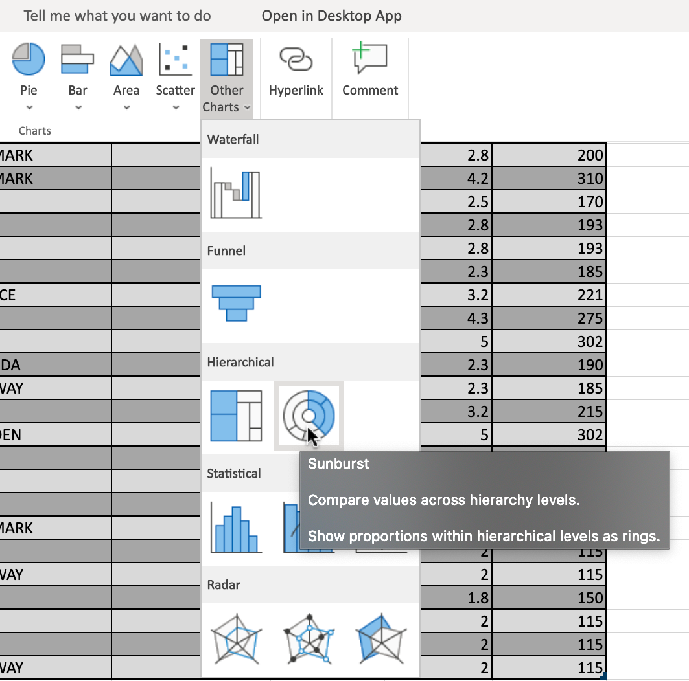
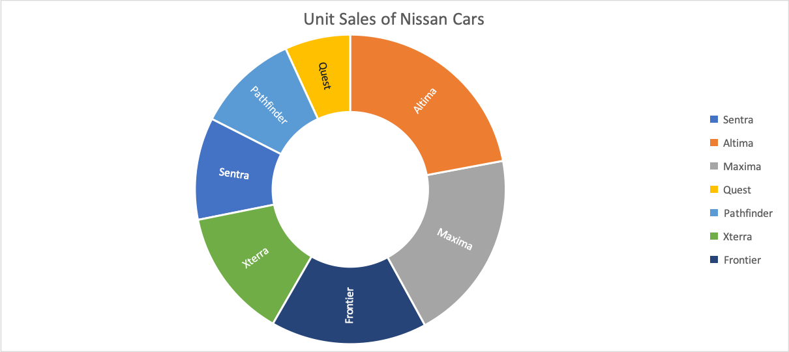
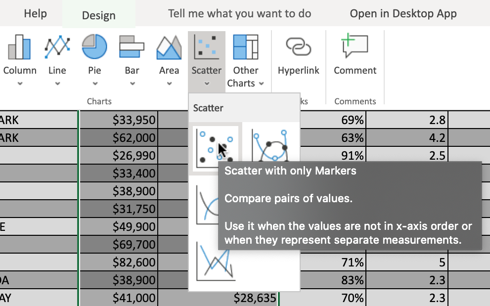
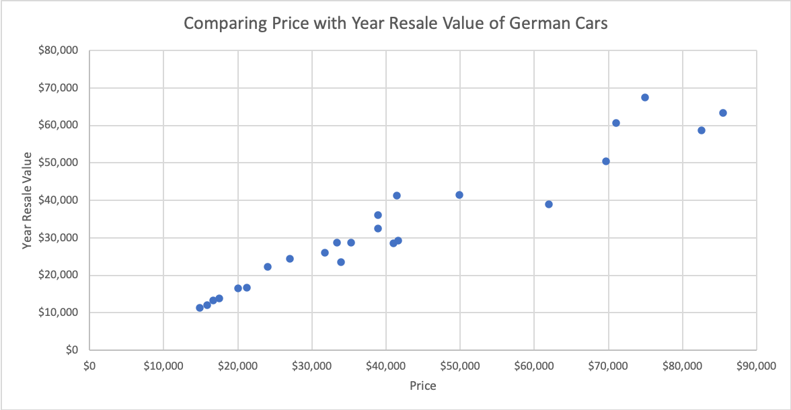
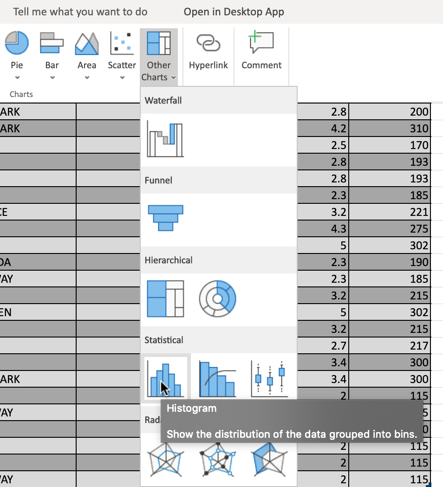
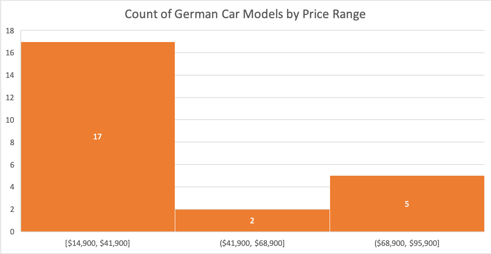

# Exercise 1: Creating Sunburst, Scatter and Histogram Charts in Excel

In this exercise, you will learn how to create advanced charts, such as a sunburst chart, a scatter chart, and histogram charts in Excel.

## Task A: Create a Sunburst Chart

1. Download the file [Car_Sales_Kaggle_DV0130EN_Lab2_Start.xlsx](https://cf-courses-data.s3.us.cloud-object-storage.appdomain.cloud/IBMDeveloperSkillsNetwork-DV0130EN-SkillsNetwork/Hands-on%20Labs/Lab%202%20-%20Creating%20Advanced%20Charts%20/Car_Sales_Kaggle_DV0130EN_Lab2_Start.xlsx). Upload and open it using Excel for the web.
2. Switch to the worksheet named **Sunburst Chart**.
3. Click the drop-down arrow at the top of column A (Manufacturer).
4. In the list of filters, click **Select All** to DESELECT all filters, then scroll down the filter list and ONLY select **Nissan**, then click **Apply**.
5. Select column B, then hold **SHIFT** and select column C.
6. On the Charts group of the Insert tab, click **Other Charts** and choose **Sunburst** from the Hierarchical category.

   

7. Click on the floating chart area to access the Chart tab in the ribbon.
8. On the Labels group of the Chart tab, click **Chart Title** and select **Edit Chart Title…**.
9. In the text input area of the dialog box Edit Title, write "Unit Sales of Nissan Cars" and click **OK**.
10. On the Labels group of the Chart tab, click **Legend** and select **Show Legend at Right**.
11. Your chart should look something like the one below:

    

## Task B: Create a Scatter Chart

1.  Switch to the worksheet named **Scatter Chart**.
2.  Click the filter drop-down in column A (Manufacturer).
3.  In the filter list, only select **Audi, BMW, Mercedes-B, Porsche, Volkswagen** and click **OK**.
4.  Select column E, then hold **SHIFT** and select column F.
5.  On the Charts group of the Insert tab, click **Scatter Chart** and choose **Scatter with only Markers** from the Scatter category.

    

6.  Drag the chart across to the right of the sheet.
7.  Click on the floating chart area to access the Chart tab in the ribbon.
8.  On the Labels group of the Chart tab, click **Chart Title** and select **Edit Chart Title…**.
9.  In the text input area of the dialog box Edit Title, write "Comparing Price with Year Resale Value of German Cars" and click **OK**.
10. On the Labels group of the Chart tab, click **Axis Titles** and select **Primary Horizontal Axis Title** > **Edit Horizontal Axis Title…**.
11. In the text input area of the dialog box Edit Title, write "Price" and click **OK**.
12. On the Labels group of the Chart tab, click **Axis Titles** and select **Primary Vertical Axis Title** > **Edit Vertical Axis Title…**.
13. In the text input area of the dialog box Edit Title, write "Year Resale Value" and click **OK**.
14. On the Labels group of the Chart tab, click **Legend** and select **None**.
15. Your chart should look something like the one below:

    

## Task C: Create a Histogram Chart

1. Switch to the worksheet named **Histogram Chart**.
2. Click the drop-down arrow at the top of column A (Manufacturer).
3. In the filter list, only select **Audi, BMW, Mercedes-B, Porsche, Volkswagen** and click **OK**.
4. Select column B, then hold **SHIFT** and select column C.
5. On the Charts group of the Insert tab, click **Other Charts** and choose **Histogram** from the Statistical category.

   

6. Drag the chart across to the right of the sheet.
7. Click on the floating chart area to access the Chart tab in the ribbon.
8. On the Labels group of the Chart tab, click **Chart Title** and select **Edit Chart Title…**.
9. In the text input area of the dialog box Edit Title, write "Count of German Car Models by Price Range" and click **OK**.
10. On the Labels group of the Chart tab, click **Data Labels** and select **Center**.
11. On the Format group of the Chart tab, click **Format**.
12. On the right side menu bar Format, select Series "Price" > **Fill** > **Orange, Accent 2**.
13. Your chart should look something like the one below:

    

## Solution

- [Car_Sales_Kaggle_DV0130EN_Lab2_Start.xlsx](./Car_Sales_Kaggle_DV0130EN_Lab2_Start.xlsx) _(137 KB)_
