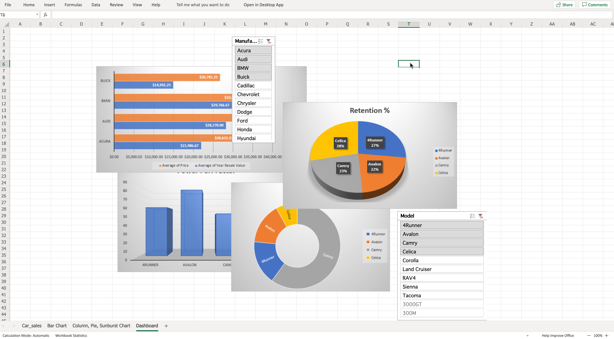
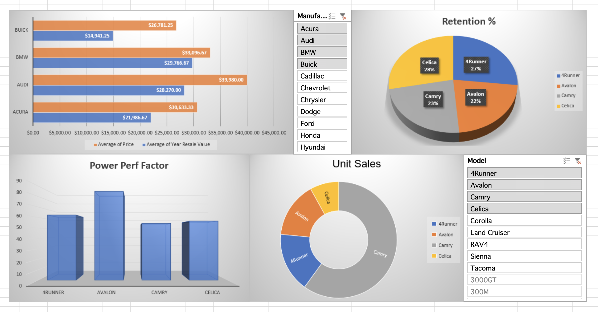
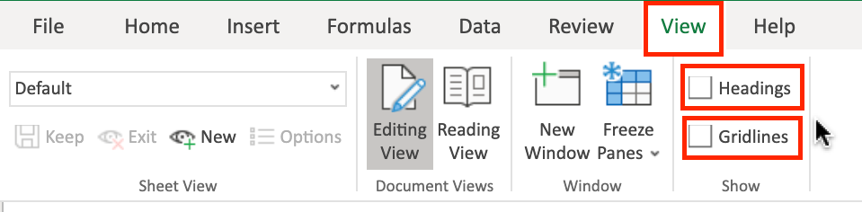
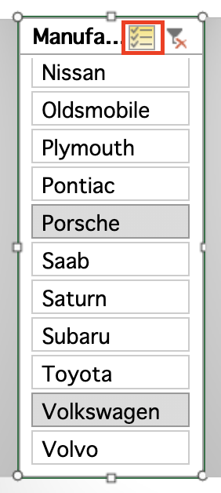
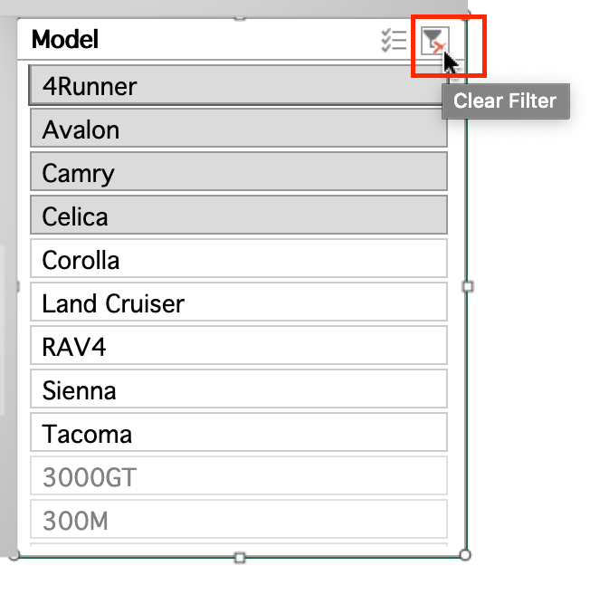
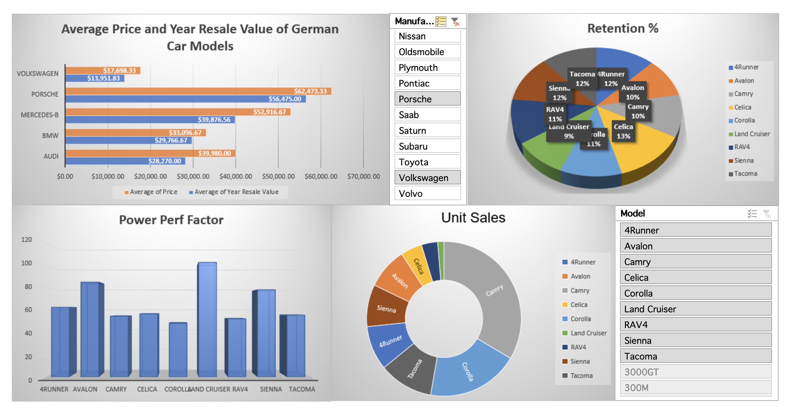

# Exercise 1: Setting Up a Dashboard in Excel

In this exercise, you will learn how to set up a simple dashboard with visualizations in Excel.

1. Download the file [Car_Sales_Kaggle_DV0130EN_Lab3_Start.xlsx](https://cf-courses-data.s3.us.cloud-object-storage.appdomain.cloud/IBMDeveloperSkillsNetwork-DV0130EN-SkillsNetwork/Hands-on%20Labs/Lab%203%20-%20Creating%20a%20Simple%20Dashboard%20with%20Excel/Car_Sales_Kaggle_DV0130EN_Lab3_Start.xlsx). Upload and open it using Excel for the web.
2. Click **+** to add a new worksheet, then double-click the **Sheet1** tab and rename it to **Dashboard**, then click **OK**.
3. Drag the **Dashboard** tab to the far right of the workbook tabs if needed.
4. Select the **Column, Pie, Sunburst Chart** worksheet tab.
5. Select the **Column chart** and press **CTRL+C**.
6. Select the **Dashboard** tab, click somewhere in the middle of the sheet, and press **CTRL+V**.
7. Select the **Column, Pie, Sunburst Chart** worksheet tab.
8. Select the **Pie chart** and press **CTRL+C**.
9. Select the **Dashboard** tab, click somewhere in the middle of the sheet, and press **CTRL+V**.
10. Select the **Column, Pie, Sunburst Chart** worksheet tab.
11. Select the **Sunburst chart** and press **CTRL+C**.
12. Select the **Dashboard** tab, click somewhere in the middle of the sheet, and press **CTRL+V**.

> If you have a copy of Excel Desktop you can continue on here and do both exercises using the first start file provided.
>
> **Note:** Excel for the web cannot copy slicers and pivot charts, so if you are using a version of Excel for the web, you will need to stop this exercise here, then open the provided [Car_Sales_Kaggle_DV0130EN_Lab3_Ex2Start.xlsx](https://cf-courses-data.s3.us.cloud-object-storage.appdomain.cloud/IBMDeveloperSkillsNetwork-DV0130EN-SkillsNetwork/Hands-on%20Labs/Lab%203%20-%20Creating%20a%20Simple%20Dashboard%20with%20Excel/Car_Sales_Kaggle_DV0130EN_Lab3_Ex2Start.xlsx) file, and then continue from Exercise 2 Step 1 below.

13. Select the **Column, Pie, Sunburst Chart** worksheet tab.
14. Select the **Slicer** and press **CTRL+C**.
15. Select the **Dashboard** tab, click somewhere in the middle of the sheet, and press **CTRL+V**.
16. Select the **Bar Chart** worksheet tab.
17. Select the **Bar chart** and press **CTRL+C**.
18. Select the **Dashboard** tab, click somewhere in the middle of the sheet, and press **CTRL+V**.
19. Select the **Bar Chart** worksheet tab.
20. Select the **Slicer** and press **CTRL+C**.
21. Select the **Dashboard** tab, click somewhere in the middle of the sheet, and press **CTRL+V**.
22. At the end of this exercise your Dashboard worksheet should look like the image below:

    

---

# Exercise 2: Configuring a Dashboard Layout in Excel

In this exercise, you will learn how to organize and layout the content of a dashboard in Excel.

> If you are using Excel for the web, then you need to open the starter file provided in the link above, after Exercise 1 Step 12.

1.  Select and drag the **Bar chart** to the top left corner of the sheet.
2.  Select and drag the **Manufacturer slicer** to the top of the sheet on the right of the Bar chart.
3.  Select and drag the **Pie chart** to the top right of the sheet on the right of the Manufacturer slicer.
4.  Select and drag the **Column chart** to the bottom left of the sheet under the Bar chart.
5.  Select and drag the **Sunburst chart** to the bottom of the sheet on the right of the Column chart.
6.  Select and drag the **Model slicer** to the bottom left of the sheet under the Pie chart.
7.  Drag and resize all the charts to make them fit better.

    

8.  Select the **View** tab in the ribbon, and uncheck **Gridlines** and **Headings**.

    

9.  Double-click any tab to collapse the ribbon.
10. In the **Manufacturer slicer**, select **Audi** and click the **Multi-Select** button. Then scroll the slicer and select only **Audi, BMW, Mercedes-B, Porsche, Volkswagen**.

    

11. Click on the **Bar chart** area to access the Chart tab in the ribbon.
12. On the Labels group of the Chart tab, click **Chart Title** and select **Edit Chart Title…**.
13. In the text input area of the dialog box Edit Title, write "Average Price and Year Resale Value of German Car Models" and click **OK**.
14. In the **Model slicer**, click the **Clear Filter** button.

    

Finally your dashboard should look similar to the image below:

## Solution

- [Car_Sales_Kaggle_DV0130EN_Lab3_Start.xlsx](./Car_Sales_Kaggle_DV0130EN_Lab3_Start.xlsx) _(131 KB)_
- [Car_Sales_Kaggle_DV0130EN_Lab3_Ex2Start.xlsx](./Car_Sales_Kaggle_DV0130EN_Lab3_Ex2Start.xlsx) _(138 KB)_
