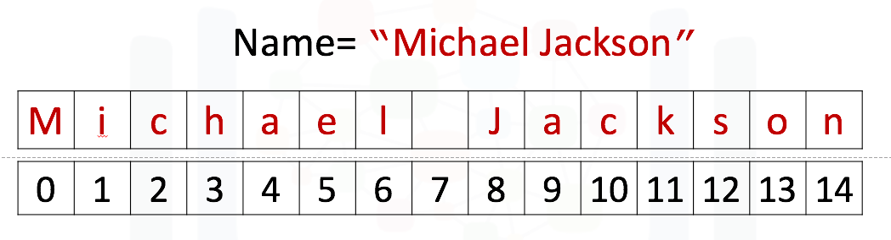

# Practice Quiz - Questions and Answers

## Module 1 - Types

1. **What is the data type of the entity 43?**
   - [x] int
   - [ ] float
   - [ ] bool
   - [ ] complex

   Anwer: Correct! Int or integer types are numbers that contain no decimals. They can be positive or negative.

2. **What data type does 3.12323 represent?**
   - [ ] bool
   - [ ] int
   - [x] float
   - [ ] str

   Answer: Correct! As the number contains decimal values, it belongs to the category of floating-point numbers.

3. **What is the result of the following: `int(3.99)`?**
   - [x] 3
   - [ ] 3.99
   - [ ] 4

   Answer: Correct! When a number is a typecast, only the integral part is retained, discarding the fractional part.

## Module 1 - Expressions and Variables

1. **What is the result of the operation: `11//2`**
   - [x] 5
   - [ ] 5.5
   - [ ] 11/2
   - [ ] 0.18

   Answer: Correct! The // symbol represents integer division, removing decimal values.

2. **What is the value of x after the following is run:**

   ```python
   x = 4
   x = x/2
   ```

   - [x] 2.0
   - [ ] 0.5
   - [ ] 1.0
   - [ ] 4.0

   Answer: Correct! The first expression assigns a value to a variable, while the second expression modifies the same variable. The result is in float because division in python using '/' returns a float.

3. **Which line of code will perform the action as required for implementing the following equation?**

   ```python
   y = 2x^2 - 3
   ```

   - [ ] `y = 2x*x – 3`
   - [x] `y = 2*x*x – 3`
   - [ ] `y = 2x/2 – 3`
   - [ ] `y = 2*x*2 – 3`

   Answer: Correct! Valid implementation. In python x\*x is used to represent the expression x^2

## Module 1 - String Operations

1. **What is the result of the following?** `Name[-1]`

   
   - [ ] "n"
   - [ ] "i"
   - [ ] "M"
   - [x] "o"

   **Answer:** The index having a value of -1 denotes the final position within a cyclic sequence.

2. **What is the result of the following?** `print("AB\nC\nDE")`
   - [ ] AB CD E
   - [ ] ABC DE
   - [x] AB / C / DE
   - [ ] AB\nC\nDE

   **Answer:** When the `print` function comes across the `\n` character, it displays a new line.

3. **What is the output of the following?** `"helloMike".find("Mike")`
   - [ ] 6
   - [x] 5
   - [ ] 6,7,8
   - [ ] 2

   **Answer:** The method helps you locate the position of the first character in a given string that matches the first character of a specified substring.

## Module 2 - Lists and Tuples

1. **Consider the following tuple:**

   ```python
      say_what = ('say', 'what', 'you', 'will')
   ```

   **What is the result of the following?** `say_what[-1]`
   - [ ] 'what!'
   - [ ] say_what '
   - [x] 'will'
   - [ ] 'you!'

   **Answer:** An index of −1 corresponds to the last item of a tuple, such as the string 'will'.

2. **Consider the following tuple** `A = (1, 2, 3, 4, 5)`. **What is the outcome of the following?** `A[1:4]`
   - [x] (2, 3, 4)
   - [ ] (1, 2, 3, 4)
   - [ ] (3, 4, 5)
   - [ ] (2, 3, 4, 5)

   **Answer:** The indexes 1, 2, and 3 of the tuple correspond to these elements.

3. **Consider the following list** `B = [1, 2, [3, 'a'], [4, 'b']]`. **What is the result of** `B[3][1]`**?**
   - [ ] 2
   - [x] 'b'
   - [ ] [4, 'b']
   - [ ] 'a'

   **Answer:** The list that follows relates to the index of nested list B[3].

4. **What is the outcome of the following operation?**

   ```python
      [1, 2, 3] + [1, 1, 1]
   ```

   - [ ] [1, 2, 3; 1, 1, 1]
   - [x] [1, 2, 3, 1, 1, 1]
   - [ ] TypeError
   - [ ] [2, 3, 4]

   **Answer:** The addition operator combines lists through concatenation.

5. **What will be the length of the list A after executing the following code:**

   ```python
      A = [1]
      A.append([2, 3, 4, 5])
   ```

   - [ ] 10
   - [x] 2
   - [ ] 5
   - [ ] 6

   **Answer:** Append adds the entire list [2, 3, 4, 5] as a single element.

## Module 2 - Dictionaries

1. **What are the keys of the following dictionary?** `{"a":1,"b":2}`
   - [ ] a, b
   - [ ] 1, 2
   - [x] ["a","b"]
   - [ ] {"a","b"}

   **Answer:** The key is the first element separated from its value by a colon.

2. **Consider the following Python Dictionary:**

   ```python
      Dict = {"A":1, "B":"2", "C":[3,3,3], "D":(4,4,4), 'E':5, 'F':6}
   ```

   **What will be the outcome of the following operation?** `Dict["D"]`
   - [ ] 1
   - [x] (4, 4, 4)
   - [ ] '4, 4, 4'
   - [ ] [3,3,3]

   **Answer:** This corresponds to the key 'D' or Dict['D'].

3. **Which of the following is the correct syntax to extract the keys of a dictionary as a list?**
   - [ ] `keys(dict.list())`
   - [x] `list(dict.keys())`
   - [ ] `dict.keys().list()`
   - [ ] `list(keys(dict))`

   **Answer:** This is the correct syntax.

## Module 2 - Sets

1. **Consider the following set:** `{"A","A"}`, **what will the result be when you create the set?**
   - [ ] {"A", "A"}
   - [ ] {"A", "B"}
   - [ ] {}
   - [x] {"A"}

   **Answer:** Sets in Python do not allow duplicate elements. Consequently, the resulting set will automatically eliminate the duplicate, resulting in {"A"}.

2. **What method do you use to add an element to a set?**
   - [ ] Append
   - [ ] Insert
   - [ ] Extend
   - [x] Add

   **Answer:** The `add` method adds elements to a set.

3. **What is the result of the following operation?** `{'a','b'} & {'a'}`
   - [ ] {'b'}
   - [ ] {'a','b'}
   - [ ] {}
   - [x] {'a'}

   **Answer:** The intersection operation finds the common elements in both sets.

## Module 3 - Conditions and Branching

1. **What is the outcome of the following?** `1=2`
   - [ ] True
   - [ ] ValueError: invalid literal for int()
   - [x] SyntaxError: can't assign to literal
   - [ ] False

   **Answer:** This statement results in a syntax error.

2. **What is the output of the following code segment?**

   ```python
      i = 6
      i < 5
   ```

   - [ ] True
   - [x] False

   **Answer:** 6 is not less than 5.

3. **True or False. What is the output of the below code snippet?**

   ```python
      'a' == 'A'
   ```

   - [x] False
   - [ ] True

   **Answer:** The equality operator is case-sensitive.

4. **Which of the following best describes the purpose of `elif` statement in a conditional structure?**
   - [x] It defines the condition in case the preceding conditions in the if statement are not fulfilled.
   - [ ] It describes a condition to test if all other conditions have failed.
   - [ ] It describes a condition to test for if any one of the conditions has not been met.
   - [ ] It describes the end of a conditional structure.

   **Answer:** You can use the `elif` statement only when you do not meet any of the prior conditions.

## Module 3 - Loops

1. **What will be the result of the following?**

   ```python
      for x in range(0, 3):
         print(x)
   ```

   - [x] 0 / 1 / 2
   - [ ] 0 / 1 / 2 / 3
   - [ ] 0 / 1
   - [ ] 1 / 2 / 3

   **Answer:** The range function will generate values in the range 0 to 3, excluding 3.

2. **What is the output of the following:**

   ```python
      for x in ['A', 'B', 'C']:
         print(x + 'A')
   ```

   - [x] AA / BA / CA
   - [ ] A / B / C
   - [ ] AA / BB / CC
   - [ ] A / B / C / A

   **Answer:** The term `x + 'A'` performs string concatenation.

3. **What is the output of the following?**

   ```python
      for i, x in enumerate(['A', 'B', 'C']):
         print(i, x)
   ```

   - [ ] AA / BB / CC
   - [x] 0 A / 1 B / 2 C
   - [ ] 0 / 1 / 2
   - [ ] A 0 / B 1 / C 2

   **Answer:** The enumerate method returns the corresponding index.

## Module 3 - Functions

1. **What does the following function return?** `len(['A','B',1])`
   - [ ] 4
   - [ ] 2
   - [x] 3
   - [ ] 1

   **Answer:** The function returns the number of elements in the list; in this case, the number of elements is 3.

2. **What does the following function return?** `len([sum([1,1,1])])`
   - [ ] 3
   - [ ] Error
   - [x] 1
   - [ ] 0

   **Answer:** The function returns the length of the sum of the elements in the list.

3. **After executing the following code segment, what will be the value of list L?**

   ```python
      L = [1, 3, 2]
      sorted(L)
   ```

   - [ ] [1, 2, 3]
   - [ ] [3, 2, 1]
   - [ ] [0, 0, 0]
   - [x] [1, 3, 2]

   **Answer:** sorted is a function that returns a new list. It does not change the list L.

4. **What result does the following code produce?**

   ```python
      def print_function(A):
         for a in A:
            print(a + '1')
      print_function(['a', 'b', 'c'])
   ```

   - [ ] a / b / c
   - [x] a1 / b1 / c1
   - [ ] a1
   - [ ] abc1

   **Answer:** The function concatenates the string with the number 1.

## Module 3 - Exception Handlings

1. **Why do we use exception handlers?**
   - [ ] To read a file
   - [ ] To write a file
   - [ ] To terminate a program
   - [x] To catch errors within a program

   **Answer:** Exception handlers catch errors in the codes.

2. **What is the purpose of a try…except statement?**
   - [ ] Executes only when a particular condition is true
   - [ ] Executes the code block under a specific condition
   - [ ] Crash a program when errors occur
   - [x] Catch and handle exceptions when an error occurs

   **Answer:** It handles code crashes in case of errors.

3. **Consider the following code:**

   ```python
      a = 1
      try:
         b = int(input("Please enter a number to divide a: "))
         a = a / b
         print("Success a =", a)
      except:
         print("There was an error")
   ```

   **If the user enters the value of `b` as 0, what is expected as the output?**
   - [ ] Success a=1/0
   - [ ] ZeroDivisionError
   - [ ] Success a=NaN
   - [x] There was an error

   **Answer:** This division will generate an error, leading to the exception part.

## Module 3 - Objects and Classes

1.  **Which of the following statements will create an object 'C1' for the class that uses radius as 4 and color as 'yellow'?**

    ```python
       class Circle(object):
          # Constructor
          def __init__(self, radius=3, color='blue'):
             self.radius = radius
             self.color = color

          # Method
          def add_radius(self, r):
             self.radius = self.radius + r
    ```

    - [ ] `C1 = Circle('yellow', 4)`
    - [ ] `C1.radius = Circle.radius(4)`
    - [ ] `C1.color = Circle.color('yellow')`
    - [x] `C1 = Circle(4, 'yellow')`
    - [ ] `C1 = Circle()`

    **Answer:** `C1 = Circle(4, 'yellow')` correctly creates an instance of the Circle class with C1 having a radius of 4 and its color set to 'yellow.'

2.  **Consider the execution of the following lines of code:**

    ```python
       CircleObject = Circle()
       CircleObject.radius = 10
    ```

    **What are the values of the radius and color attributes for the CircleObject after their execution?**

    ```python
       class Circle(object):
          # Constructor
          def __init__(self, radius=3, color='blue'):
             self.radius = radius
             self.color = color

          # Method
          def add_radius(self, r):
             self.radius = self.radius + r
             return self.radius
    ```

    - [ ] 10, 'red'
    - [ ] 3, 'blue'
    - [x] 10, 'blue'
    - [ ] 3, 'red'

    **Answer:** The radius attribute is updated to 10 while the color attribute is kept as default 'blue.'

3.  **What is the color attribute of the object V1?**

    ```python
       class Vehicle:
          color = "white"

          def __init__(self, max_speed, mileage):
             self.max_speed = max_speed
             self.mileage = mileage
             self.seating_capacity = None

          def assign_seating_capacity(self, seating_capacity):
             self.seating_capacity = seating_capacity

       V1 = Vehicle(150, 25)
    ```

    - [x] 'white'
    - [ ] Error in creation of object
    - [ ] 25
    - [ ] 150

    **Answer:** The default setting for the 'color' attribute is 'white,' eliminating the need to pass it while creating the object.

4.  **Which of the following options would create an appropriate object that points to a red, 5-seater vehicle with a maximum speed of 200kmph and a mileage of 20kmpl?**

    ```python
       class Vehicle:
          color = "white"

          def __init__(self, max_speed, mileage):
             self.max_speed = max_speed
             self.mileage = mileage
             self.seating_capacity = None

          def assign_seating_capacity(self, seating_capacity):
             self.seating_capacity = seating_capacity

       V1 = Vehicle(150, 25)
    ```

    - [ ] `Car = Vehicle(200, 20)`
    - [x] `Car = Vehicle(200, 20) Car.color = 'red' Car.assign_seating_capacity(5)`
    - [ ] `Car = Vehicle(200, 20) Car.color = 'red'`
    - [ ] `Car = Vehicle(200, 20) Car.assign_seating_capacity(5)`

    **Answer:** All attributes are correctly assigned here.

5.  **What is the value printed upon execution of the code shown below?**

    ```python
    class Graph():
       def __init__(self, id):
          self.id = id
          self.id = 80

    val = Graph(200)
    print(val.id)
    ```

    - [x] 80
    - [ ] 200
    - [ ] invalid syntax
    - [ ] 0

    **Answer:** The value of the attribute is overwritten to 80 every time the object is created, irrespective of the value of the attribute passed.
