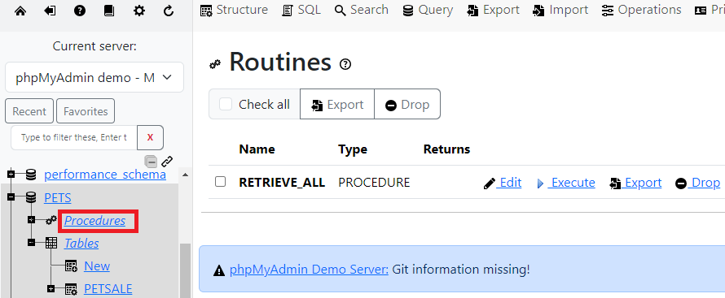
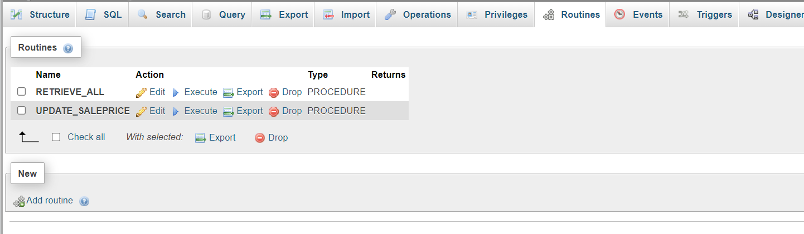

# Stored Procedure - MYSQL

## Create a stored procedure

### 1. Create a stored procedure routine named `RETRIEVE_ALL`. This `RETRIEVE_ALL` routine will contain an SQL query to retrieve all the records from the PETSALE table, so you don't need to write the same query over and over again. You just call the stored procedure routine to execute the query everytime.

```sql
DELIMITER //

CREATE PROCEDURE RETRIEVE_ALL()

BEGIN
   SELECT *  FROM PETSALE;
END //
DELIMITER ;
```

### 2. Call the `RETRIEVE_ALL` routine.

```sql
CALL RETRIEVE_ALL;
```

### 3. You can view the created stored procedure routine `RETRIEVE_ALL`. On the left panel, expand the PETS database option and click on Procedures to view the procedure.



### Drop the stored procedure routine `RETRIEVE_ALL`

```sql
DROP PROCEDURE RETRIEVE_ALL;

CALL RETRIEVE_ALL;
```

## Create and execute a stored procedure to write/modify data in a table

### 1. Create a stored procedure routine named `UPDATE_SALEPRICE` with parameters Animal_ID and Animal_Health.

- This `UPDATE_SALEPRICE` routine will contain SQL queries to update the sale price of the animals in the PETSALE table depending on their health conditions, BAD or WORSE.
- This procedure routine will take animal ID and health conditon as parameters which will be used to update the sale price of animal in the PETSALE table by an amount depending on their health condition
  - For animal with ID XX having BAD health condition, the sale price will be reduced further by 25%.
  - For animal with ID YY having WORSE health condition, the sale price will be reduced further by 50%.
  - For animal with ID ZZ having other health condition, the sale price won't change.

```sql
DELIMITER @
CREATE PROCEDURE UPDATE_SALEPRICE (IN Animal_ID INTEGER, IN Animal_Health VARCHAR(5))
BEGIN
    IF Animal_Health = 'BAD' THEN
        UPDATE PETSALE
        SET SALEPRICE = SALEPRICE - (SALEPRICE * 0.25)
        WHERE ID = Animal_ID;
    ELSEIF Animal_Health = 'WORSE' THEN
        UPDATE PETSALE
        SET SALEPRICE = SALEPRICE - (SALEPRICE * 0.5)
        WHERE ID = Animal_ID;
    ELSE
        UPDATE PETSALE
        SET SALEPRICE = SALEPRICE
        WHERE ID = Animal_ID;
    END IF;
END @

DELIMITER ;
```

### 2. Call the `UPDATE_SALEPRICE` routine. We want to update the sale price of animal with ID 1 having BAD health condition in the PETSALE table

```sql
   CALL RETRIEVE_ALL;

   CALL UPDATE_SALEPRICE(1, 'BAD');

   CALL RETRIEVE_ALL;
```

### 3. Call the `UPDATE_SALEPRICE` routine once again. We want to update the sale price of animal with ID 3 having WORSE health condition in the PETSALE table

```sql
   CALL RETRIEVE_ALL;

   CALL UPDATE_SALEPRICE(3, 'WORSE');

   CALL RETRIEVE_ALL;
```

### 4. You can view the created stored procedure routine `UPDATE_SALEPRICE`. Click on the Routines and view the procedure.



### 5. Drop the stored procedure routine `UPDATE_SALEPRICE`

```sql
DROP PROCEDURE UPDATE_SALEPRICE;

CALL UPDATE_SALEPRICE;
```
