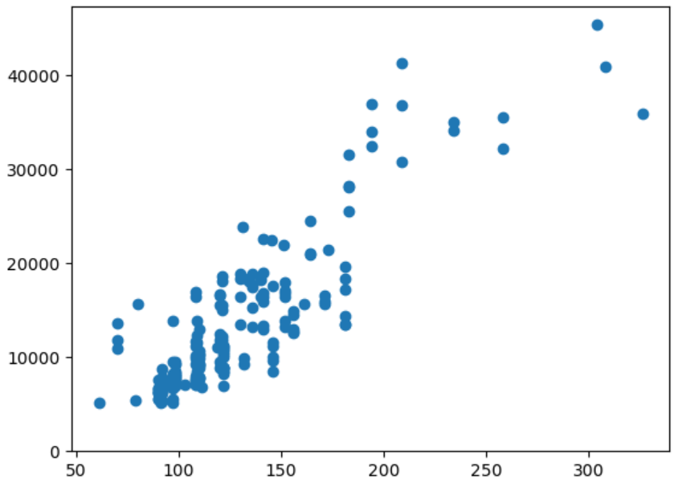
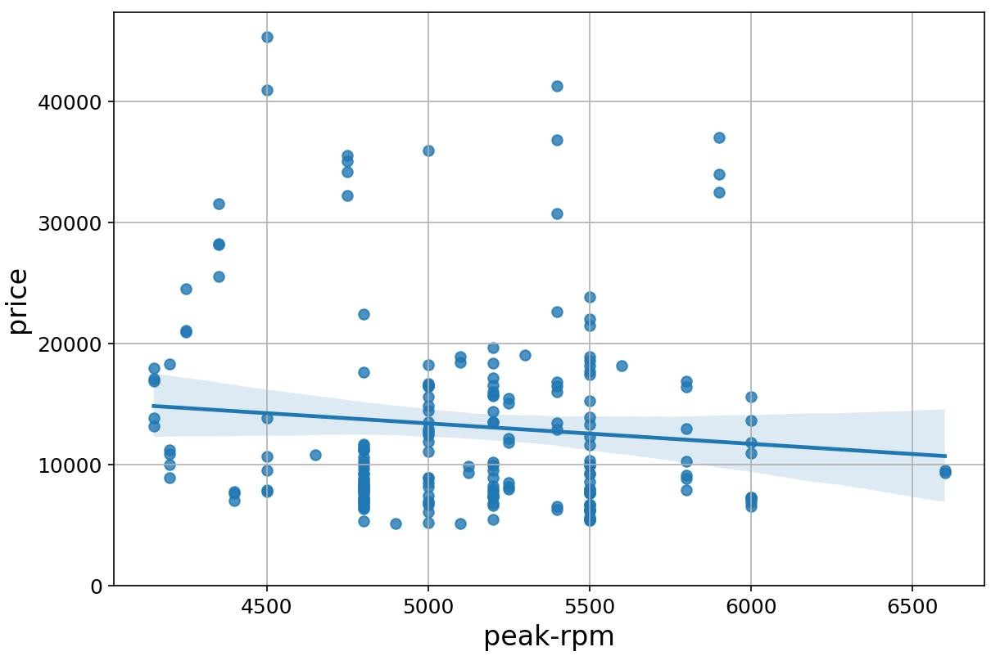
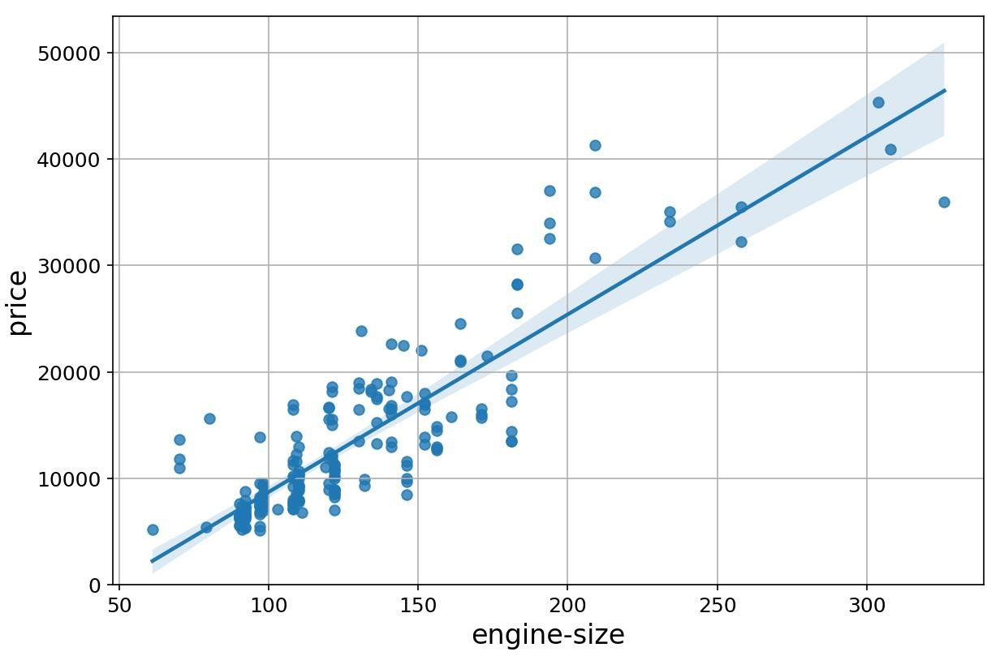
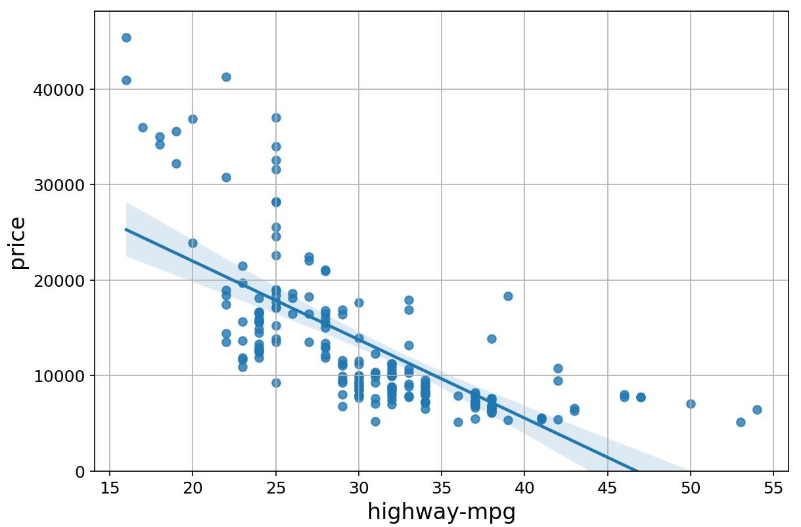
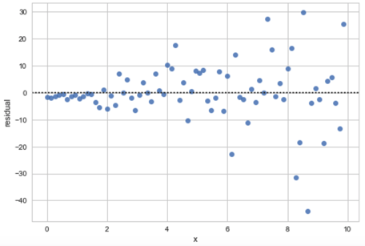

# Practice Quiz - Questions and Answers

## Module 1 - Importing Data Sets

1. **Which of the following commands would you use to retrieve only the attribute datatypes of a dataset loaded as pandas data frame df?**
   - [ ] `df.describe(include='all')`
   - [x] `df.dtypes`
   - [ ] `df.info()`
   - [ ] `df.describe()`

   **Answer:** `df.dtypes` is the command that retrieves only the attribute datatypes.

2. **What description best describes the library Pandas?**
   - [ ] Includes functions for creating various plots that can be used to create different visualizations for the dataset.
   - [x] Offers data structures and tools for effective data manipulation and analysis, providing fast access to structured data.
   - [ ] Includes functions for some advanced math problems and scientific processes such as integration and optimization.
   - [ ] A highly efficient array processing library capable of quickly performing mathematical transformation functions on single or multi-dimensional arrays.

   **Answer:** The primary instrument of Pandas is the DataFrame, a two-dimensional table with rows and columns. It simplifies tasks like indexing, slicing, and cleaning data, making it the standard for data manipulation.

3. **What task does the following code perform?**

   ```python
   path = 'C:\Windows\...\automobile.csv'
   df.to_csv(path)
   ```

   - [ ] Opens a CSV file specified by the path for manual editing.
   - [ ] Converts a CSV file in the directory specified by the path to a data frame.
   - [x] Exports your Pandas data frame to a new CSV file in the location specified by the variable path.
   - [ ] Loads a CSV file from the local directory into a new data frame.

     **Answer:** The `.to_csv()` method is an "output" function. It takes the data currently held in the DataFrame df and writes it into a permanent file on your local machine at the specified path.

4. **How would you use the describe() method with a data frame df to get a statistical summary of all the columns in the data frame?**
   - [ ] `df.describe(include="None")`
   - [ ] `df.describe(include="columns")`
   - [x] `df.describe(include="all")`
   - [ ] `df.describe(include="summary")`

   **Answer:** By passing `include="all"`, you tell Pandas to calculate statistics for every column regardless of type. For text columns, it will provide the number of unique values, the most frequent value, and its frequency.

## Module 2 - Data Wrangling

1. **What is the correct syntax to access a column, say "symboling," from a dataframe, say df?**
   - [ ] `df.get("symboling")`
   - [x] `df["symboling"]`
   - [ ] `df="symboling"`
   - [ ] `df=="symboling"`

   **Answer:** This is the correct syntax for accessing the column "symboling" from the data frame df.

2. **How would you change the name of the column "city_mpg" to "city-L/100km"?**
   - [ ] `df.rename(columns={"city_mpg": "city-L/100km"})`
   - [ ] `df.columnname={"city_mpg": "city-L/100km"})`
   - [ ] `df.columnheader(columns={"city_mpg": "city-L/100km"}, inplace=True)`
   - [x] `df.rename(columns={"city_mpg": "city-L/100km"}, inplace=True)`

   **Answer:** You rename the column "city_mpg" to "city-L/100km" using this syntax.

3. **What is the primary purpose of normalization?**
   - [ ] So all the variables have a similar influence on the models you build
   - [x] To make the range of the values consistent and make comparing and analyzing values easier
   - [ ] It brings data into a common standard of expression
   - [ ] To get rid of "not a number" or NaN values

   **Answer:** Normalization makes it so the range of values for a variable is consistent.

4. **Why do we convert categorical variables into numerical values?**
   - [x] Most statistical models require numerical values
   - [ ] It makes it easier to visualize the data
   - [ ] It makes it easier to fill in missing data
   - [ ] To save memory

   **Answer:** It is easier to deal with numerical values in statistical models than categorical variables.

## Module 3 - Exploratory Data Analysis

1. **Which method produces the following type of plot?**

   <br>
   - [ ] `plot.box()`
   - [ ] `plot.graph()`
   - [x] `plot.scatter()`
   - [ ] `plot.dot()`

   **Answer:** The `plot.scatter()` method produces a scatter plot with the characteristics shown.

2. **Select the appropriate description of a pivot table:**
   - [ ] You can convert a pivot table to a Python dictionary.
   - [x] A pivot table has one variable displayed along the columns and the other variable displayed along the rows.
   - [ ] A pivot table should only contain object data types.
   - [ ] A pivot table contains descriptive statistics in each column.

   **Answer:** A pivot table organizes data by displaying one variable along the columns and another variable along the rows.

3. **Select the scatter plot with a weak correlation:**
   - [x]

      

   - [ ]

      

   - [ ]

      

   - [ ] None of these

   **Answer:** The plot shows little relationship between the two variables.

4. **Consider the following scatter plots a, b, and c. Which plot has the highest correlation coefficient?**

   
   - [ ] b
   - [x] They all have the same value.
   - [ ] c
   - [ ] a

   **Answer:** Correlation is not related to the slope of the line.

## Module 4 - Model Development

1. **Consider the following lines of code. What is the name of the column that contains the target values?**

   ```python
      from sklearn.linear_model import LinearRegression
      lm = LinearRegression()
      X = df[['highway-mpg']]
      Y = df['price']
      lm.fit(X, Y)
      Yhat = lm.predict(X)
   ```

   - [ ] 'highway-mpg'
   - [ ] fit
   - [x] 'price'
   - [ ] Yhat

   **Answer:** This is the column name of the target values.

2. **Consider the following Residual Plot from a linear model. What information does it give you?**

   <br>
   - [ ] Since it does not show a pattern in the error values, it indicates the linear model is a good fit.
   - [ ] Since it does not show a pattern in the error values, it indicates the linear model is not a good fit.
   - [x] Since it shows a pattern in the error values, it indicates the linear model is not a good fit.

   **Answer:** The variance of the residuals increases with x, which indicates that the model is not a good fit.

3. **Which statement is most accurate about a higher-order polynomial model than a linear one?**
   - [x] You cannot compare their R2 values to decide which is a better fit.
   - [ ] The linear model will usually appear to fit the data better.
   - [ ] When you compare their R2 values, the larger value indicates the better fit.
   - [ ] When you compare their R2 values, the smaller value indicates the better fit.

   **Answer:** Higher-order polynomials usually fit the data better because they have more curvature, so the R2 value does not provide this information.

4. **Consider the following lines of code. What value does the variable out contain?**

   ```python
      lm = LinearRegression()
      X = df[['highway-mpg']]
      Y = df['price']
      lm.fit(X, Y)
      out = lm.score(X, Y)
   ```

   - [ ] A multiple linear regression
   - [ ] Mean Squared Error with respect to X
   - [x] The Coefficient of Determination
   - [ ] Mean Square Error with respect to y.

   **Answer:** The `score()` method will calculate the coefficient of determination of a linear regression model.
