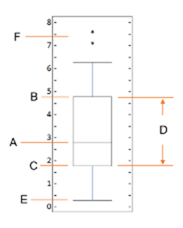

# Graded Quiz - Questions and Answers

## Module 1 - Introduction to Data Visualization Tools

1. **Who was the creator of Matplotlib?**
   - [x] John Hunter, an American neurobiologist
   - [ ] James Gosling, a Canadian computer scientist
   - [ ] Daniel Johnson, a German physicist
   - [ ] Cleve Moler, an American mathematician and computer programmer

   **Answer:** The creator of Matplotlib was John Hunter, an American neurobiologist.

2. **Using the inline backend, at what point can you not modify a figure?**
   - [ ] Before it is rendered
   - [ ] After it is created
   - [ ] After it is coded
   - [x] After it is rendered

   **Answer:** One limitation of this backend is that you cannot modify a figure once it's rendered. So, after rendering the figure, we cannot add, for example, a figure title or labels to its axes.

3. **Using Matplotlib magic functions, which code starts the command?**
   - [ ] `%matplotlib notebook`
   - [ ] `$matplotlib outline`
   - [ ] `%matplotlib`
   - [x] `%matplotlib inline`

   **Answer:** The command starts with "%matplotlib," and notebook is one of the Matplotlib backends. A sign of a magic function is that it starts with "%matplotlib."

4. **True or False. A line plot displays information as a series of data points connected by straight lines.**
   - [ ] False
   - [x] True

   **Answer:** Line plots display information as a series of data points connected by straight lines.

5. **True or False. Matplotlib's three main layers are: Backend, Artist, and Scripting.**
   - [ ] False
   - [x] True

   **Answer:** Matplotlib's three main layers are Backend Layer, Artist Layer, and Scripting Layer.

6. **What is Jupyter Notebook?**
   - [ ] A well-established data visualization library that can be integrated into different environments
   - [ ] It is a tool used for creating conventional visualization tools using the plot function
   - [x] An open-source web application that allows you to create and share documents that contain live code, visualizations, and some explanatory text as well
   - [ ] A Python library with a number of different backends available

   **Answer:** Jupyter Notebook is an open-source web application that allows you to create and share documents that contain live code, visualizations, and some explanatory text as well.

7. **True or False. Matplotlib was initially developed as an EEG and ECoG visualization tool.**
   - [x] True
   - [ ] False

   **Answer:** Matplotlib was initially developed as an EEG and ECoG visualization tool.

8. **True or False. The backend layer's three built-in interface classes are FigureCanvas, Renderer, and Event.**
   - [ ] False
   - [x] True

   **Answer:** Correct. FigureCanvas, Renderer, and Event are the backend layer's three built-in interface classes

9. **True or False: Line plots can be misleading if the scales on the axes are not carefully chosen to reflect the data accurately.**
   - [x] True
   - [ ] False

   **Answer:** Line plots can be misleading if the scales on the axes are not carefully chosen to reflect the data accurately. Line plots capture trends and changes over time, allowing us to see patterns and fluctuations.

10. **Which of the following plots is not ideal for comparing different categories or groups? Select all that apply.**
    - [x] Line plots
          _Feedback: Line plots are not ideal for comparing different categories or groups._
    - [x] Pie plots
          _Feedback: Pie plots are not ideal for comparing different categories or groups._
    - [x] Scatter plots
          _Feedback: Scatter plots are not ideal for comparing different categories or groups._
    - [ ] Bar plots

## Module 2 - Basic and Specialized Visualization Tools

1. **What does a scatter plot display?**
   - [x] Values pertaining to typically two variables against each other.
   - [ ] Numbers
   - [ ] Graphs
   - [ ] Data

   **Answer:** A scatter plot displays values pertaining to typically two variables against each other. Usually, it is a dependent variable that is plotted against an independent variable to determine if any correlation between the two variables exists.

2. **The `_________` module offers a convenient way to create and customize plots quickly?**
   - [x] Pyplot
   - [ ] Folium
   - [ ] Plotly
   - [ ] Numpy

   **Answer:** Matplotlib is a general-purpose comprehensive plotting library. Its pyplot module offers a convenient way to create and customize plots quickly.

3. **A pie chart is a `__________` statistical graphic, divided into segments, to illustrate numerical proportions.**
   - [ ] Bar chart
   - [ ] Line plot
   - [ ] Folium
   - [x] Circular

   **Answer:** A pie chart is a circular statistical graphic, divided into segments, to illustrate numerical proportions.

4. **True or False. A box plot has five key statistical measures to statistically represent the distribution of a given data?**
   - [ ] False
   - [x] True

   **Answer:** A box plot is a way of statistically representing the distribution of given data through five key statistical measures. These include Minimum, First quartile, Median, Third quartile, and Maximum.

5. **True or False. Area plots are like a line plot but with the area below the line filled with color to emphasize the cumulative magnitude of the variables.**
   - [ ] False
   - [x] True

   **Answer:** An area plot, also known as an area chart or graph, displays the magnitude and proportion of multiple variables over a continuous axis, typically representing time or another ordered dimension.

6. **In the above chart, what do the letters in the box plot above represent?**

    
   - [x] A = Median, B = Third Quartile, C = First Quartile, D = Inter Quartile Range, E = Minimum, and F = Outliers
   - [ ] A = Mean, B = Third Quartile, C = First Quartile, D = Inter Quartile Range, E = Minimum, and F = Maximum
   - [ ] A = Median, B = Third Quartile, C = Mean, D = Inter Quartile Range, E = Lower Quartile, and F = Outliers
   - [ ] A = Mean, B = Upper Mean Quartile, C = Lower Mean Quartile, D = Inter Quartile Range, E = Minimum, and F = Outliers

   **Answer:** Correct. These are the statistical measures for Box Plots.

7. **To plot a line chart of x versus y in Matplotlib, we use the command `_________________`.**
   - [ ] `df.plot(x, y)`
   - [x] `plt.plot(x, y)`
   - [ ] `plt.scatter(x, y)`
   - [ ] `plt.bar(x, y)`

   **Answer:** `plt.plot(x, y)` is the correct Matplotlib command to create a line chart, where the points in x and y are connected by a line.

8. **When creating a histogram in Matplotlib what is the first step?**
   - [ ] Import histogram as mpl and its scripting interface as plt.
   - [ ] Import histogram as plt and its scripting interface as mpl.
   - [ ] Import matplotlib as mpl and its scripting interface as plt.
   - [x] Import matplotlib as plt and its scripting interface as mpl.

   **Answer:** The first step when creating a histogram in matplotlib is to import matplotlib as mpl and its scripting interface as plt.

9. **What is the process of creating a scatter plot?**
   - [ ] The process of creating a scatter plot involves importing a dataset library.
   - [ ] The process of creating a scatter plot involves importing datapoints to visualize a large set of data.
   - [x] The process of creating a scatter plot involves importing Matplotlib to visualize a large set of data.
   - [ ] The process of creating a scatter plot involves importing Plotly libraries.

   **Answer:** A scatter plot is a type of plot that displays values pertaining to typically two variables against each other. The process of creating a scatter plot involves importing Matplotlib to visualize a large set of data.

10. **A bar chart is also known as a `__________`?**
    - [ ] Histogram
    - [ ] Pyplot
    - [ ] Bar plot
    - [x] Bar graph

    **Answer:** Unlike a histogram, a bar chart, also known as a bar graph, is a type of plot where the length of each bar is proportional to the value of the item that it represents.
